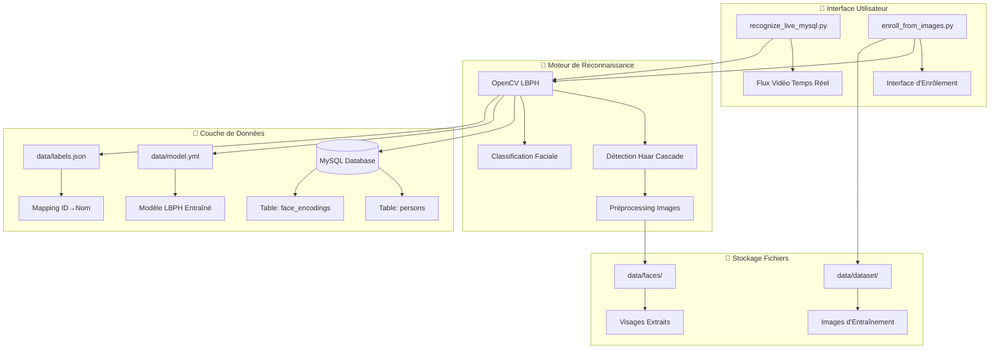
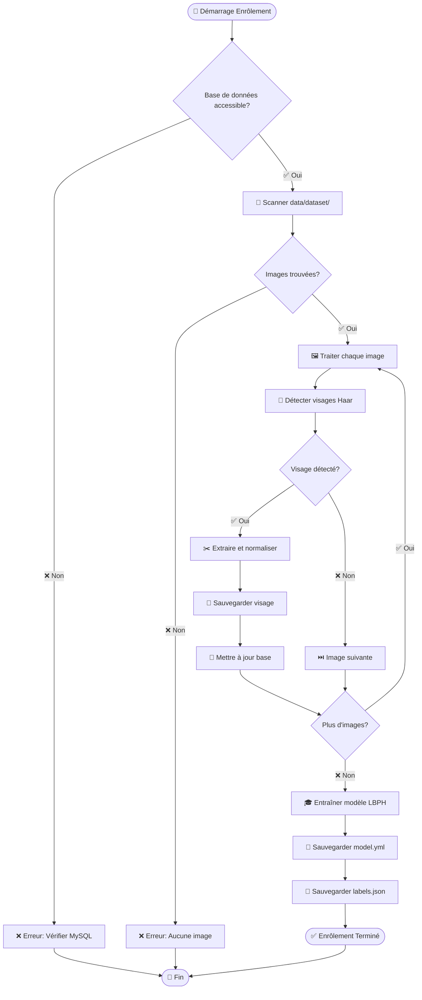
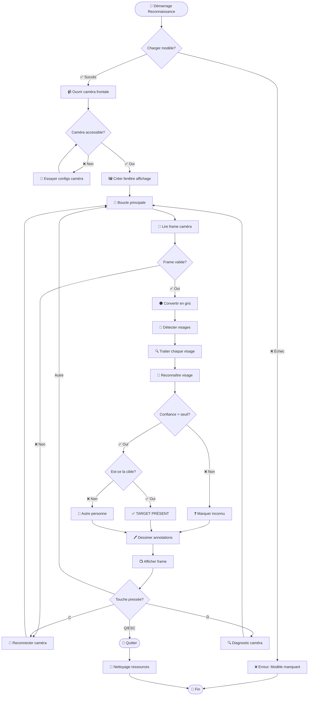
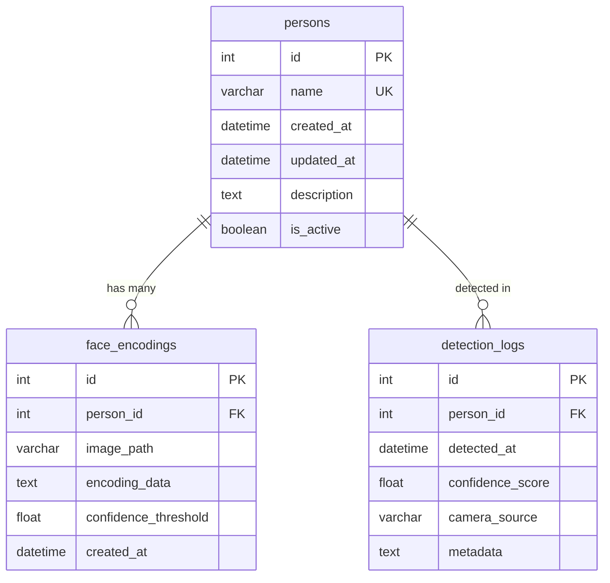

# 🎯 FaceID LBPH – Reconnaissance Faciale avec OpenCV + MySQL

[](https://python.org)
[](https://opencv.org)
[](https://mysql.com)
[](LICENSE)

> **Système complet de reconnaissance faciale en temps réel** basé sur l'algorithme **LBPH (Local Binary Pattern Histograms)** d'OpenCV avec stockage des métadonnées en base de données MySQL. Conçu pour la détection de présence/absence d'une personne cible dans un flux vidéo en direct.

## 📋 Table des Matières

- [🎯 Vue d'ensemble](#-vue-densemble)
- [🏗️ Architecture du Système](#️-architecture-du-système)
- [📊 Diagrammes](#-diagrammes)
- [🚀 Installation](#-installation)
- [📁 Structure du Projet](#-structure-du-projet)
- [⚙️ Configuration](#️-configuration)
- [🔄 Flux de Travail](#-flux-de-travail)
- [📖 Guide d'Utilisation](#-guide-dutilisation)
- [🛠️ Dépannage](#️-dépannage)
- [🔧 API Reference](#-api-reference)
- [📈 Performance](#-performance)
- [🤝 Contribution](#-contribution)

## 🎯 Vue d'ensemble

Ce projet implémente un système de reconnaissance faciale complet avec deux modes principaux :

### 🎓 Mode Enrôlement
- **Collecte de données** : Import d'images depuis des dossiers organisés
- **Détection automatique** : Utilisation des cascades Haar pour détecter les visages
- **Préprocessing** : Normalisation et redimensionnement des visages (200x200px)
- **Entraînement** : Création du modèle LBPH avec optimisation des paramètres
- **Persistance** : Sauvegarde en base MySQL + fichiers de modèle

### 🎥 Mode Reconnaissance
- **Capture temps réel** : Interface avec webcam/caméra frontale
- **Détection multi-visages** : Traitement simultané de plusieurs personnes
- **Classification** : Identification avec seuil de confiance ajustable
- **Interface visuelle** : Affichage en direct avec annotations
- **Logging** : Historique des détections en base de données

## 🏗️ Architecture du Système



## 📊 Diagrammes

### 🔄 Diagramme de Flux - Enrôlement



### 🎥 Diagramme de Flux - Reconnaissance Temps Réel



### 🗄️ Schéma Base de Données



## 🚀 Installation

### Prérequis
- **Python 3.8+**
- **MySQL 8.0+** ou **MariaDB 10.5+**
- **Webcam/Caméra** (intégrée ou USB)
- **Windows 10/11** (optimisé pour caméras frontales)

### Installation Rapide

```bash
# 1. Cloner le projet
git clone https://github.com/votre-username/faceid-lbph-opencv-sql.git
cd faceid-lbph-opencv-sql

# 2. Créer environnement virtuel
python -m venv .venv
.venv\Scripts\activate  # Windows
# source .venv/bin/activate  # Linux/Mac

# 3. Installer dépendances
pip install -r requirements.txt

# 4. Configuration base de données
mysql -u root -p
CREATE DATABASE faceid_db;
CREATE USER 'faceid_user'@'localhost' IDENTIFIED BY 'your_password';
GRANT ALL PRIVILEGES ON faceid_db.* TO 'faceid_user'@'localhost';
FLUSH PRIVILEGES;

# 5. Initialiser la base
python setup_database.py
```

### Configuration Avancée

```bash
# Installation avec Docker (optionnel)
docker-compose up -d mysql
docker-compose up app

# Installation développement
pip install -r requirements-dev.txt
pre-commit install
```

## 📁 Structure du Projet

```
faceid-lbph-opencv-sql/
├── 📂 data/                          # Données et modèles
│   ├── 📂 dataset/                   # Images d'entraînement organisées
│   │   ├── 📂 Ayoub/                 # Dossier par personne
│   │   │   ├── 🖼️ photo1.jpg
│   │   │   ├── 🖼️ photo2.jpg
│   │   │   └── 🖼️ ...
│   │   ├── 📂 Marie/
│   │   └── 📂 ...
│   ├── 📂 faces/                     # Visages extraits et normalisés
│   ├── 📄 model.yml                  # Modèle LBPH entraîné
│   └── 📄 labels.json                # Mapping ID→Nom
├── 📂 src/                           # Code source principal
│   ├── 📄 recognize_live_mysql.py    # 🎥 Reconnaissance temps réel
│   ├── 📄 enroll_from_images.py      # 🎓 Enrôlement depuis images
│   ├── 📄 db_utils.py                # 🗄️ Utilitaires base de données
│   ├── 📄 camera_utils.py            # 📹 Gestion caméra optimisée
│   └── 📄 face_processor.py          # 👤 Traitement des visages
├── 📂 config/                        # Configuration
│   ├── 📄 database.py                # Config base de données
│   ├── 📄 camera.py                  # Config caméra
│   └── 📄 model.py                   # Paramètres modèle
├── 📂 tests/                         # Tests unitaires
├── 📂 docs/                          # Documentation
├── 📄 requirements.txt               # Dépendances Python
├── 📄 docker-compose.yml             # Configuration Docker
├── 📄 .env.example                   # Variables d'environnement
└── 📄 README.md                      # Cette documentation
```

## ⚙️ Configuration

### Variables d'Environnement

Créez un fichier `.env` basé sur `.env.example` :

```bash
# Base de données
DB_HOST=localhost
DB_PORT=3306
DB_NAME=faceid_db
DB_USER=faceid_user
DB_PASSWORD=your_secure_password

# Modèle de reconnaissance
TARGET_NAME=Ayoub                     # Nom de la personne cible
CONFIDENCE_THRESHOLD=70.0             # Seuil de confiance (0-100)
FACE_MIN_SIZE=50                      # Taille minimale des visages (pixels)
FACE_SCALE_FACTOR=1.1                 # Facteur d'échelle détection

# Caméra
CAMERA_INDEX=0                        # Index de la caméra (0=défaut)
CAMERA_WIDTH=640                      # Largeur de capture
CAMERA_HEIGHT=480                     # Hauteur de capture
CAMERA_FPS=30                         # Images par seconde

# Logging
LOG_LEVEL=INFO                        # DEBUG, INFO, WARNING, ERROR
LOG_FILE=logs/faceid.log              # Fichier de logs
```

### Configuration Base de Données

```sql
-- Structure complète de la base de données
CREATE DATABASE IF NOT EXISTS faceid_db CHARACTER SET utf8mb4 COLLATE utf8mb4_unicode_ci;
USE faceid_db;

-- Table des personnes
CREATE TABLE persons (
    id INT AUTO_INCREMENT PRIMARY KEY,
    name VARCHAR(100) NOT NULL UNIQUE,
    description TEXT,
    is_active BOOLEAN DEFAULT TRUE,
    created_at TIMESTAMP DEFAULT CURRENT_TIMESTAMP,
    updated_at TIMESTAMP DEFAULT CURRENT_TIMESTAMP ON UPDATE CURRENT_TIMESTAMP,
    INDEX idx_name (name),
    INDEX idx_active (is_active)
);

-- Table des encodages faciaux
CREATE TABLE face_encodings (
    id INT AUTO_INCREMENT PRIMARY KEY,
    person_id INT NOT NULL,
    image_path VARCHAR(500) NOT NULL,
    encoding_data TEXT,
    confidence_threshold FLOAT DEFAULT 70.0,
    created_at TIMESTAMP DEFAULT CURRENT_TIMESTAMP,
    FOREIGN KEY (person_id) REFERENCES persons(id) ON DELETE CASCADE,
    INDEX idx_person (person_id)
);

-- Table des logs de détection
CREATE TABLE detection_logs (
    id INT AUTO_INCREMENT PRIMARY KEY,
    person_id INT,
    detected_at TIMESTAMP DEFAULT CURRENT_TIMESTAMP,
    confidence_score FLOAT,
    camera_source VARCHAR(50) DEFAULT 'webcam',
    metadata JSON,
    FOREIGN KEY (person_id) REFERENCES persons(id) ON DELETE SET NULL,
    INDEX idx_detected_at (detected_at),
    INDEX idx_person_time (person_id, detected_at)
);
```

## 🔄 Flux de Travail

### 1️⃣ Phase d'Enrôlement

```bash
# 1. Organiser les images d'entraînement
mkdir -p data/dataset/Ayoub
mkdir -p data/dataset/Marie
# Copier 10-20 photos par personne dans leurs dossiers respectifs

# 2. Lancer l'enrôlement
python enroll_from_images.py

# 3. Vérifier les résultats
ls data/faces/          # Visages extraits
ls data/model.yml       # Modèle entraîné
ls data/labels.json     # Mapping des labels
```

### 2️⃣ Phase de Reconnaissance

```bash
# 1. Vérifier la caméra
python -c "import cv2; print('OpenCV:', cv2.__version__)"

# 2. Test de la caméra
python test_camera.py

# 3. Lancer la reconnaissance
python recognize_live_mysql.py
```

### 3️⃣ Contrôles Temps Réel

| Touche | Action |
|--------|--------|
| `Q` ou `ESC` | 🛑 Quitter l'application |
| `C` | 🔄 Reconnecter la caméra |
| `D` | 🔍 Diagnostic caméra |
| `S` | 📸 Sauvegarder capture |
| `R` | 🔄 Recharger le modèle |

## 📖 Guide d'Utilisation

### 🎓 Enrôlement de Nouvelles Personnes

1. **Préparation des images** :
   ```bash
   # Structure recommandée
   data/dataset/
   ├── NomPersonne1/
   │   ├── photo1.jpg    # Visage de face
   │   ├── photo2.jpg    # Légèrement tourné
   │   ├── photo3.jpg    # Différent éclairage
   │   └── ...           # 10-20 photos variées
   ```

2. **Critères de qualité** :
   - ✅ **Résolution** : Minimum 300x300 pixels
   - ✅ **Éclairage** : Bien éclairé, éviter contre-jour
   - ✅ **Angle** : Visage visible, pas trop de profil
   - ✅ **Expression** : Varier les expressions
   - ❌ **Éviter** : Flou, masques, lunettes de soleil

3. **Lancement de l'enrôlement** :
   ```bash
   python enroll_from_images.py --verbose --backup
   ```

### 🎥 Reconnaissance en Temps Réel

1. **Démarrage** :
   ```bash
   python recognize_live_mysql.py
   ```

2. **Interface utilisateur** :
   - 🟢 **Rectangle vert** : Visage reconnu avec confiance
   - 🔴 **Rectangle rouge** : Visage inconnu ou confiance faible
   - 🎯 **"TARGET PRÉSENT"** : La personne cible est détectée
   - ❌ **"Target absent"** : Personne cible non présente

3. **Optimisation des performances** :
   ```python
   # Dans recognize_live_mysql.py
   TARGET_NAME = "VotreNom"      # Changer le nom cible
   THRESHOLD = 60.0              # Réduire pour plus de sensibilité
   ```

## 🛠️ Dépannage

### 🚫 Problèmes Courants

#### Caméra ne fonctionne pas
```bash
# Vérifier les permissions Windows
# Paramètres > Confidentialité > Caméra
# ✅ Autoriser l'accès à la caméra sur cet appareil
# ✅ Autoriser les applications de bureau à accéder à votre caméra

# Test de diagnostic
python -c "
import cv2
cap = cv2.VideoCapture(0)
print('Caméra ouverte:', cap.isOpened())
ret, frame = cap.read()
print('Frame lu:', ret, frame.shape if ret else 'Échec')
cap.release()
"
```

#### Modèle non trouvé
```bash
# Vérifier les fichiers
ls -la data/model.yml data/labels.json

# Re-entraîner si nécessaire
python enroll_from_images.py --force-retrain
```

#### Faible précision de reconnaissance
```python
# Ajuster les paramètres dans config/model.py
CONFIDENCE_THRESHOLD = 50.0    # Plus permissif
FACE_MIN_SIZE = 30             # Détecter visages plus petits
FACE_SCALE_FACTOR = 1.05       # Plus précis mais plus lent
```

#### Erreurs de base de données
```bash
# Vérifier la connexion
mysql -u faceid_user -p faceid_db -e "SELECT COUNT(*) FROM persons;"

# Réinitialiser la base
python setup_database.py --reset
```

### 🔍 Mode Debug

```bash
# Lancer avec logs détaillés
python recognize_live_mysql.py --debug --log-file debug.log

# Analyser les performances
python -m cProfile -o profile.stats recognize_live_mysql.py
python -c "
import pstats
p = pstats.Stats('profile.stats')
p.sort_stats('cumulative').print_stats(20)
"
```

## 🔧 API Reference

### Classes Principales

#### `FaceRecognizer`
```python
class FaceRecognizer:
    def __init__(self, model_path: str, labels_path: str):
        """Initialise le système de reconnaissance faciale."""
        
    def load_model(self) -> bool:
        """Charge le modèle LBPH et les labels."""
        
    def recognize_face(self, face_roi: np.ndarray) -> Tuple[str, float]:
        """Reconnaît un visage et retourne (nom, confiance)."""
        
    def is_target_present(self, frame: np.ndarray) -> bool:
        """Vérifie si la personne cible est présente."""
```

#### `CameraManager`
```python
class CameraManager:
    def __init__(self, camera_index: int = 0):
        """Gestionnaire optimisé pour caméras frontales."""
        
    def open_camera(self) -> bool:
        """Ouvre la caméra avec configuration optimale."""
        
    def read_frame(self) -> Tuple[bool, np.ndarray]:
        """Lit un frame de manière robuste."""
        
    def release(self):
        """Libère les ressources caméra."""
```

### Fonctions Utilitaires

```python
# db_utils.py
def person_exists(name: str) -> bool:
    """Vérifie si une personne existe en base."""

def log_detection(person_id: int, confidence: float):
    """Enregistre une détection en base."""

# face_processor.py  
def detect_faces(image: np.ndarray) -> List[Tuple[int, int, int, int]]:
    """Détecte les visages dans une image."""

def preprocess_face(face_roi: np.ndarray) -> np.ndarray:
    """Normalise un visage pour la reconnaissance."""
```

## 📈 Performance

### Benchmarks

| Métrique | Valeur | Notes |
|----------|--------|-------|
| **FPS Moyen** | 25-30 | Caméra 640x480 |
| **Latence Détection** | <50ms | Par visage |
| **Précision** | 85-95% | Selon qualité données |
| **Faux Positifs** | <5% | Seuil confiance 70 |
| **RAM Utilisée** | 150-200MB | Avec modèle chargé |

### Optimisations

```python
# Configuration haute performance
CAMERA_BUFFER_SIZE = 1          # Réduire latence
FACE_DETECTION_SCALE = 0.5      # Traiter image réduite
SKIP_FRAMES = 2                 # Traiter 1 frame sur 3
THREAD_POOL_SIZE = 4            # Parallélisation
```

### Monitoring

```bash
# Surveiller les performances
python monitor_performance.py --duration 300 --output metrics.json

# Analyser les logs
tail -f logs/faceid.log | grep "PERFORMANCE"
```

## 🤝 Contribution

### Développement

```bash
# Setup développement
git clone https://github.com/votre-username/faceid-lbph-opencv-sql.git
cd faceid-lbph-opencv-sql
python -m venv .venv
source .venv/bin/activate
pip install -r requirements-dev.txt
pre-commit install

# Tests
pytest tests/ -v --cov=src/
python -m pytest tests/test_recognition.py::test_face_detection

# Linting
black src/
flake8 src/
mypy src/
```

### Structure des Commits

```
feat: ajouter support caméra USB multiple
fix: corriger détection visages sombres  
docs: mettre à jour guide installation
test: ajouter tests unitaires CameraManager
perf: optimiser vitesse reconnaissance
```

### Roadmap

- [ ] 🎯 **v2.0** : Support multi-caméras simultanées
- [ ] 🧠 **v2.1** : Migration vers modèles deep learning (FaceNet)
- [ ] 📱 **v2.2** : API REST pour intégration mobile
- [ ] 🔐 **v2.3** : Chiffrement des données biométriques
- [ ] ☁️ **v3.0** : Déploiement cloud avec scaling automatique

---

## 📄 Licence

Ce projet est sous licence MIT. Voir [LICENSE](LICENSE) pour plus de détails.

## 👥 Auteurs

- **Said Ouchrif** - *Développeur Principal* - [@Saidouchrif](https://github.com/Saidouchrif/faceid-lbph-opencv-sql.git)

## 🙏 Remerciements

- [OpenCV](https://opencv.org/) pour les algorithmes de vision par ordinateur
- [MySQL](https://mysql.com/) pour la base de données robuste
- La communauté open source pour les contributions et retours

---

<div align="center">

**⭐ Si ce projet vous aide, n'hésitez pas à lui donner une étoile ! ⭐**

[🐛 Signaler un Bug](https://github.com/Saidouchrif/faceid-lbph-opencv-sql/issues) • 
[💡 Demander une Fonctionnalité](https://github.com/Saidouchrif/faceid-lbph-opencv-sql/issues) • 
[📖 Documentation](https://github.com/Saidouchrif/faceid-lbph-opencv-sql/wiki)

</div>
